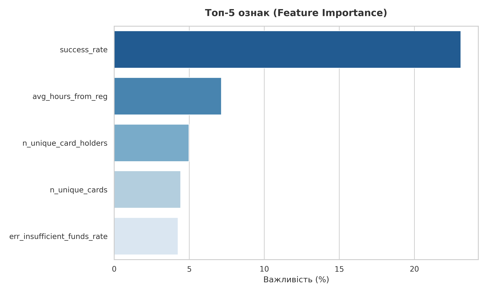
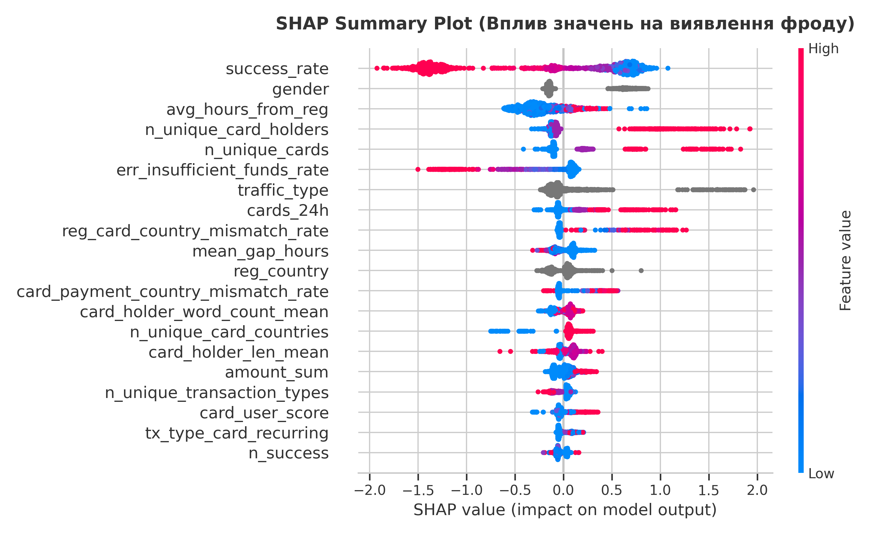
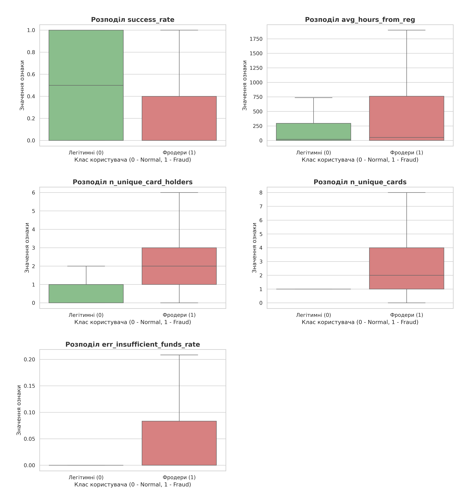
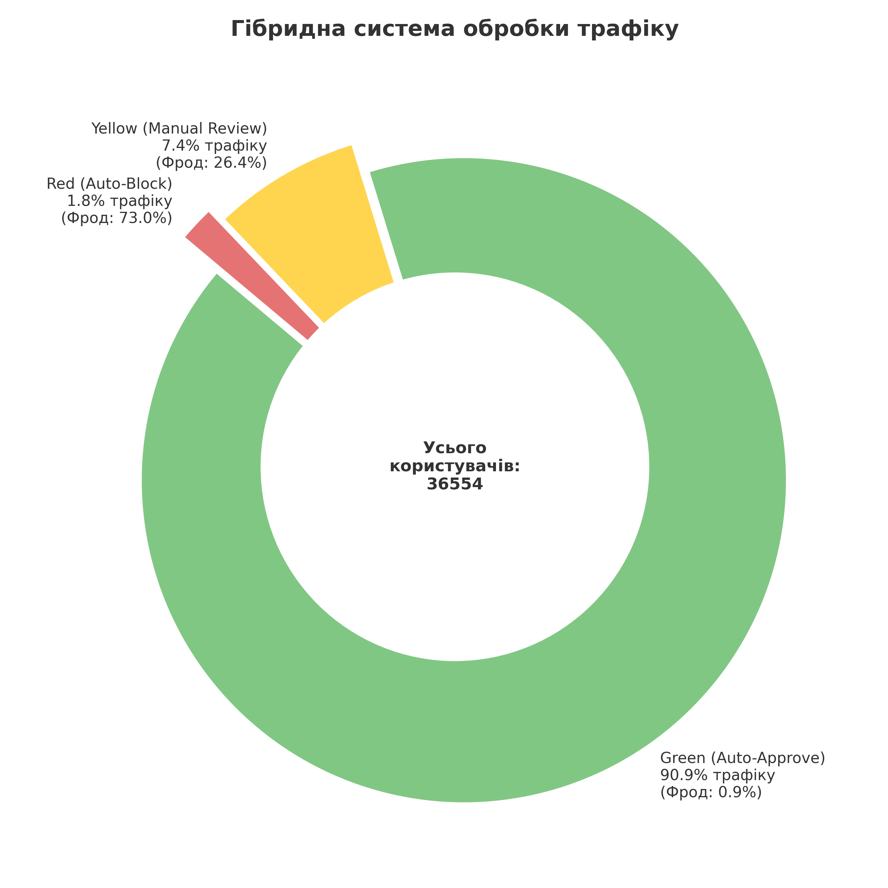

# Anti-fraud test task

## 1. Технічна реалізація та максимізація F1-score 

Для вирішення задачі було розроблено ML-систему на базі алгоритму градієнтного бустингу **CatBoostClassifier**. Цей вибір зумовлений його високою ефективністю при роботі з категоріальними ознаками та стійкістю до перенавчання.

### Ключові технічні рішення:

- **Time-based data split:** Щоб уникнути "заглядання в майбутнє" та витоку даних, розбиття на тренувальну та валідаційну вибірки (80/20) відбувалося **за часом реєстрації користувача** (`timestamp_reg`).

- **Боротьба з Data Leakage:** З генерації ознак було свідомо виключено статуси помилок, **які є прямим наслідком блокування користувача системою** (наприклад, помилки `fraud` або `antifraud`). Це дозволило моделі шукати реальні поведінкові патерни.

- **Feature Engineering:** Було розроблено набір агрегованих метрик для кожного користувача:
	- **velocity-ознаки** (швидкість дій після реєстрації)
	- **граф зв'язків карток** (скільки користувачів використовують одну картку)
	- **метрики невідповідності географії** 
	- **частоти конкретних банківських помилок**

### Результати моделі:

Навчання проводилось з оптимізацією метрики **ROC-AUC (результат: 0.9564)** для побудови якісного розподілу ймовірностей.
*Оптимальний поріг (threshold) для максимізації цільової метрики F1 склав `0.89`.*

- **F1-score:** 0.5605
- **Precision:** 0.5391
- **Recall:** 0.5837

## 2. Топ-5 ключових ознак та їх вплив

На основі аналізу **Feature Importance** та **SHAP-значень** було виділено 5 найважливіших предикторів фроду.
Модель успішно виявила класичні патерни шахраїв: "перебір" карток (card testing) та високу швидкість атаки (velocity).

### Перевірка гіпотез

1) **success_rate** (Відсоток успішних транзакцій)
	**Пояснення:** \
	Найважливіша ознака. Шахраї працюють з купленими базами крадених карток. Більшість таких карток вже заблоковані або не мають коштів, тому відсоток успішних оплат у фродерів аномально низький (медіана становить 0% успіху проти 50% у легітимних клієнтів). \
    **Вплив (SHAP):** \
	Низький success_rate (сині точки на SHAP-графіку) кардинально підвищує ймовірність фроду.

2) **avg_hours_from_reg** (Середній час від реєстрації до транзакції)
	**Пояснення:** \
	Шляхом аналізу сирих даних було виявлено наступне: всупереч очікуванням про "швидких ботів", шахраї в середньому роблять транзакції значно пізніше за легітимних користувачів (медіана 53 години проти 20 годин). \
    **Вплив (SHAP):** \
	Більший час від реєстрації (червоні/пурпурові точки на графіку) збільшує ймовірність класифікації користувача як шахрая.

3) **n_unique_card_holders** (Кількість унікальних імен власників) \
    **Пояснення:** \
	Легітимний користувач практично завжди використовує власні картки, де ім'я збігається (медіана = 1). Натомість наявність 2 і більше різних імен власників на одному акаунті - це нетипова поведінка, яка видає використання чужих платіжних даних.
    **Вплив (SHAP):** \
	Високі значення (червоні точки) сильно штовхають прогноз моделі в бік класу "фрод".

4) **n_unique_cards** (Кількість унікальних карток) \
	**Пояснення:** \
	Аналогічно до попереднього пункту. Пересічний легітимний клієнт за статистикою використовує рівно 1 картку (без відхилень). Спроба прив'язати багато різних карток (у шахраїв ця цифра доходить до 8 і більше).
    **Вплив (SHAP):** \
	Велике значення ознаки підвищує ризик фроду.

5) **err_insufficient_funds_rate** (Частка помилок "insufficient funds") \
    **Пояснення:** \
	Хоча загальний середній відсоток таких помилок приблизно однаковий у двох групах (~9%), аналіз розподілу показує, що шахраї стикаються з цією помилкою системно під час перебору пустих карток. Ця ознака працює не як самостійний маркер, а як тригер у комбінації з великою кількістю карток. \
    **Вплив (SHAP):** \
	Висока частота таких помилок (червоні точки на SHAP) є стійким маркером шахрайської поведінки для моделі.

## 3. Інтеграція в бізнес-процеси

Оскільки Precision моделі становить ~54%, використання жорсткого правила "пропустити/заблокувати" **призведе до автоматичного бану значної кількості легітимних клієнтів (False Positives)**. \
Це означає втрату прибутку та репутаційні ризики для бізнесу.

**Для вирішення цієї проблеми розроблено Гібридний підхід**, що базується на ймовірностях (predict_proba), виданих моделлю. \
Трафік ділиться на три зони за кастомними порогами (0.75 та 0.96):

- 🟢 **Green Zone (Auto-Approve):** *Score < 0.75*
	- **Трафік:** 90.86% користувачів.
	- **Бізнес-дія:** Пропускати автоматично.
	- **Обґрунтування:** Бізнес не створює перешкод для 91% клієнтів. Рівень фроду тут складає лише 0.95% - це економічно вигідний рівень, який перекривається прибутком від успішних транзакцій.

- 🟡 **Yellow Zone (Manual Review):** *0.75 <= Score < 0.96*
	- **Трафік:** 7.37% користувачів.
	- **Бізнес-дія:** Призупинити транзакцію. Відправити користувача на ручну перевірку (Manual Review) командою антифроду або запросити додаткову автоматичну верифікацію.
	- **Обґрунтування:** Рівень фроду - 26.4%. Навантаження на команду саппорту становить менше ніж 7.5% від усього трафіку.

- 🔴 **Red Zone (Auto-Block):** *Score >= 0.96*
	- **Трафік:** 1.77% користувачів.
	- **Бізнес-дія:** Жорстке автоматичне блокування профілю.
	- **Обґрунтування:** У цій зоні зібрані найбільш очевидні для моделі шахраї (рівень фроду ~73%).

Запропонована гібридна модель дозволяє автоматизувати понад 92% прийняття рішень (Green + Red), оптимізувати операційні витрати на ручну перевірку та зберегти лояльність чесних клієнтів платформи.

## 4. Напрямки подальшого розвитку та масштабування
### Технічні покращення моделі

- **Тюнінг гіперпараметрів:** Поточна модель CatBoost використовує базові налаштування. Використання фреймворків на кшталт Optuna для глибокого підбору гіперпараметрів дозволить отримати додаткові проценти точності.

- **Ensembling:** Для підвищення робастності (стійкості) системи можна об'єднати прогнози CatBoost з іншими архітектурами (наприклад, LightGBM або нейронними мережами, які добре витягують ембедінги з текстових полів, таких як імена власників карток).

### Advanced Feature Engineering
Для більш точного відокремлення професійних шахраїв від легітимних клієнтів необхідно вийти за межі базових транзакційних агрегацій. У майбутньому варто сфокусуватися на розширенні та деталізації "портрета" кожного користувача, а також виконати просунуту роботу з текстовими атрибутами.

Також треба попрацювати над побудовою більш повноцінного графа зв'язків ознак.

### Оптимізація бізнес-процесів
З точки зору операційної діяльності, система має не лише ловити шахраїв, але й економити ресурси компанії.
- **Баланс між Precision та Recall (Керування навантаженням):** Наразі в ручну перевірку потрапляє близько 7% трафіку. Головна бізнес-ціль у майбутньому - зменшити цю цифру. Для цього необхідно свідомо керувати ключовими метриками.
- **Автоматизація "сірої зони" (Спрощення перевірки):** Замість того, щоб одразу відправляти всіх підозрілих користувачів із "Жовтої зони" на аналіз живій людині, цей процес варто спростити.
- **Динамічні пороги (Dynamic Thresholds):** Замість використання жорстко зафіксованих порогів (наприклад, 0.75 та 0.96) можна імплементувати систему, яка автоматично зсуває ці межі залежно від поточних бізнес-умов.
